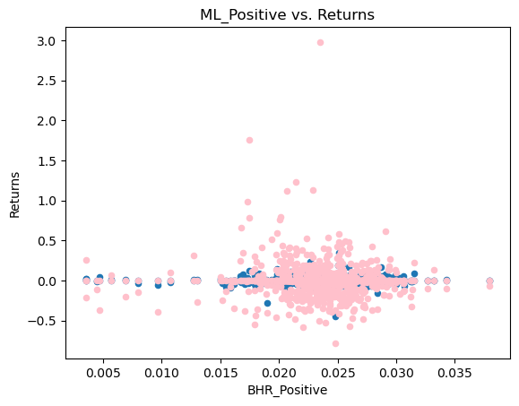
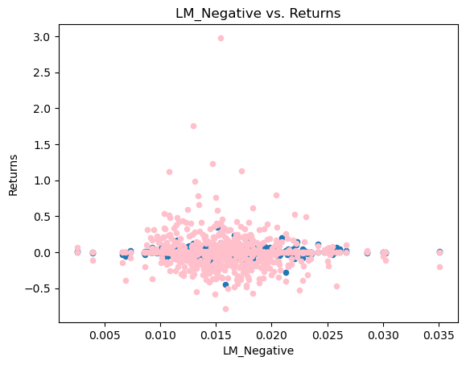
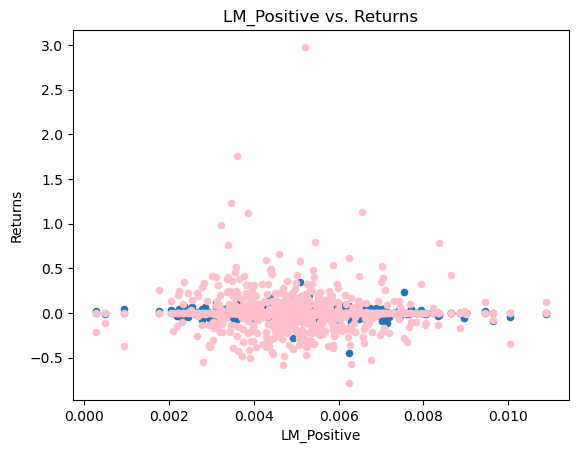
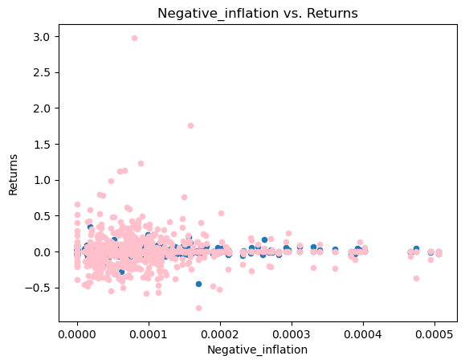
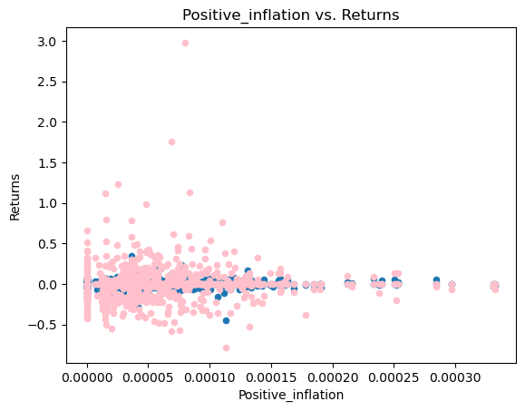
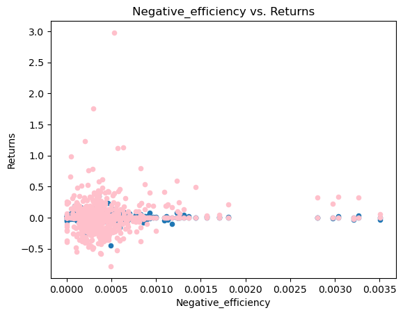
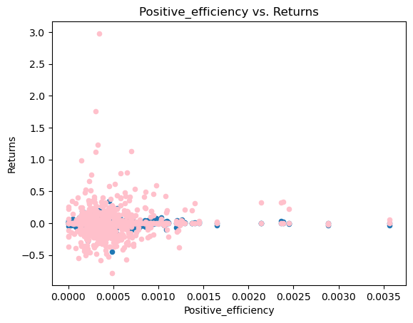
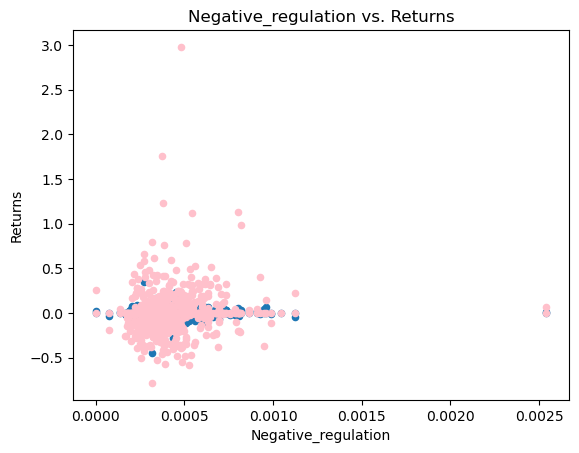
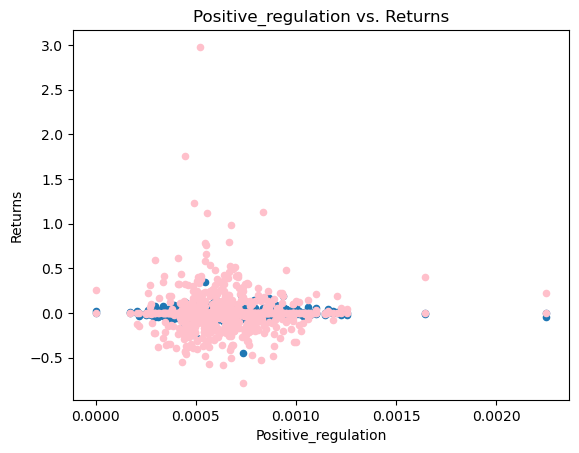

# Summary

The main focus was to analyze stock returns after a specified period of time with regards to text sentiment analysis and record any correlations between both variables. This would allow one to determine if using a text sentiment analysis would be useful for finding positive or negative stock returns. In this assignment I conducted data cleaning, returns analysis, and a text sentiment analysis across S&P500 10-k files. In the end, it was determined that the different variables showed greater variation in the data when comparing the Day 2 and Day 10 returns and contextual analysis for all ten variables. Variation was lower for the chosen topics while the general finance dictionaries like ML and LM had less variance overall, however they did not seem to have a greater impact than the chosen topics. However they set the average for the sentiment analysis scores with comparison to the returns of each stock. However these finding are not completely conclusive or certain as most scatterplots do not show much variation between each other, therefore a concrete conclusion was not gathered from this analysis. 

# Data Section

The sample provided for this analysis was from the 503 firms found in the S&P500 csv file. This included all 10K files from firms in the S&P 500 in 2022. 

The return variables are built upon taking the product of the returns for days 0-2 and days 3-10 separately. This would allow us to get the real returns for the stocks 2 days and 10 days after the 10-k filing is made public. These variables depended on the creation of columns; "Event Day", which signaled out the days where a filing was made or posted by comparing the filing date and the stock return dates, "After day" shows the days after the filing, ranging from 1-11 using 0 as a way to fill the column, then "Days1-3" and "Days4-11" served similar functions which were to further filter the data and allow for the next step taking in "Product1-3" and "Product4-11" which are the returns for the stocks with their respective days after the filing was made. 

The sentiment variables that were used were "BHR_negative", "BHR_positive", "LM_negative", "LM_positive", "Negative_inflation", "Positive_inflation", "Negative_efficiency","Positive_efficiency", "Negative_regulation" and "Positive_regulation". The "BHR_negative" and "BHR_positive" come from the ML dictionaries and include a list of words that come from the machine learning approach from the Journal of Financial Economics, they are ordered in their respective tones, negative and positive. The "LM_negative" and "LM_positive" variables are the dictionary list of words that were created by Loughran and MacDonald. After these variables I decided upon three topics, which were: inflation, efficiency, and regulation. I picked ten synonyms to the three words and this essentially based the list. I chose these topics because of their importance to businesses and the overall market, knowing that these topics and their synoynm words would come along a 10-k as all these are factors in the business world that affect how firms operate, resulting in changes in their stock returns. The three topics I chose also dwelved with the BHR or ML dictionaries in order to give them their positive and negative sentiments, which would allow me to focus and conduct my analysis on ten different variables. 


The contextual sentiment measures taken do pass the tests as they have been able to output reasonable sentiment scores and the data had been merged correctly with the BHR negative and positive dictionaries. The chosen topics had relevance to all companies and are forces in the real market that affect the stock returns and prices of publicly traded companies. The dictionaries also made sense and were logical to include in this analysis, even when joining the contextual sentiment and the journal dictionaries posted. The variables were standardized in the way the ML dictionaries were directly merged and applied to each contextual sentiment variable topics. The results would be different depending on the count of the words listed on each 10-k file, which is something that depends on the file itself, not on the variables or the words chosen for the specific topic. While some industries and companies might have been more affected per say inflation, others would be more affeced by regulation or efficiency.  The industries picked come from the S&P 500 list, therefore it covers a wide range of industries, however the chosen topic variables were not influenced by a specific industry. While some might be more inclined to appear in a certain 10-k file due to the industry the firm operates in, the topics were not chosen specifically to bias that. The different sectors and industries where firms operate would eventually impact the results of the sentiment analysis.

Results should be interpreted in this way. If the sentiment score is higher it means that the word had appeared most and had a stronger influence in the text sentiment of the 10k file, meaning that this would lead us to conclude various endings. The consistency and higher score of the negative variable sets would indicate a lower return, while a higher sentiment score among the positive variable sets would indicate greater returns, thus leading us to conclude that the sentiment of a 10-k file does affect the returns of the stock for each firm.

# Results


```python
import fnmatch
import glob
import os
import re
from time import sleep
from zipfile import ZipFile
from sec_edgar_downloader import Downloader
import warnings
import matplotlib.pyplot as plt


import numpy as np
import pandas as pd
from bs4 import BeautifulSoup
from near_regex import NEAR_regex
from tqdm import tqdm
```


```python
results = 'output/analysis_sample'
```


```python
results = pd.read_csv(results)
```


```python
results = results.drop('Unnamed: 0', axis=1)
results
```


<div>
<style scoped>
    .dataframe tbody tr th:only-of-type {
        vertical-align: middle;
    }

    .dataframe tbody tr th {
        vertical-align: top;
    }

    .dataframe thead th {
        text-align: right;
    }
</style>
<table border="1" class="dataframe">
  <thead>
    <tr style="text-align: right;">
      <th></th>
      <th>Symbol</th>
      <th>Days0-2_Returns</th>
      <th>Days3-10_Returns</th>
      <th>BHR_Negative</th>
      <th>BHR_Positive</th>
      <th>LM_Negative</th>
      <th>LM_Positive</th>
      <th>Negative_inflation</th>
      <th>Positive_inflation</th>
      <th>Negative_efficiency</th>
      <th>...</th>
      <th>mb</th>
      <th>prof_a</th>
      <th>ppe_a</th>
      <th>cash_a</th>
      <th>xrd_a</th>
      <th>dltt_a</th>
      <th>invopps_FG09</th>
      <th>sales_g</th>
      <th>dv_a</th>
      <th>short_debt</th>
    </tr>
  </thead>
  <tbody>
    <tr>
      <th>0</th>
      <td>A</td>
      <td>0.008788</td>
      <td>0.000000</td>
      <td>0.018774</td>
      <td>0.025263</td>
      <td>0.008651</td>
      <td>0.004013</td>
      <td>0.000111</td>
      <td>0.000045</td>
      <td>0.000401</td>
      <td>...</td>
      <td>4.942619</td>
      <td>0.161233</td>
      <td>0.104904</td>
      <td>0.147128</td>
      <td>0.041196</td>
      <td>0.267071</td>
      <td>4.734700</td>
      <td>0.183555</td>
      <td>0.022046</td>
      <td>0.017863</td>
    </tr>
    <tr>
      <th>1</th>
      <td>AAL</td>
      <td>-0.050923</td>
      <td>0.000000</td>
      <td>0.023794</td>
      <td>0.017957</td>
      <td>0.013274</td>
      <td>0.002809</td>
      <td>0.000048</td>
      <td>0.000021</td>
      <td>0.000110</td>
      <td>...</td>
      <td>1.285453</td>
      <td>-0.047828</td>
      <td>0.562490</td>
      <td>0.201920</td>
      <td>0.000000</td>
      <td>0.634616</td>
      <td>0.868619</td>
      <td>0.723597</td>
      <td>0.000000</td>
      <td>0.086537</td>
    </tr>
    <tr>
      <th>2</th>
      <td>AAL</td>
      <td>0.000000</td>
      <td>-0.547675</td>
      <td>0.023794</td>
      <td>0.017957</td>
      <td>0.013274</td>
      <td>0.002809</td>
      <td>0.000048</td>
      <td>0.000021</td>
      <td>0.000110</td>
      <td>...</td>
      <td>1.285453</td>
      <td>-0.047828</td>
      <td>0.562490</td>
      <td>0.201920</td>
      <td>0.000000</td>
      <td>0.634616</td>
      <td>0.868619</td>
      <td>0.723597</td>
      <td>0.000000</td>
      <td>0.086537</td>
    </tr>
    <tr>
      <th>3</th>
      <td>AAP</td>
      <td>-0.017255</td>
      <td>0.000000</td>
      <td>0.025993</td>
      <td>0.025962</td>
      <td>0.017441</td>
      <td>0.005076</td>
      <td>0.000123</td>
      <td>0.000092</td>
      <td>0.000400</td>
      <td>...</td>
      <td>1.963279</td>
      <td>0.095247</td>
      <td>0.344436</td>
      <td>0.049321</td>
      <td>0.000000</td>
      <td>0.276522</td>
      <td>1.540528</td>
      <td>0.088229</td>
      <td>0.013197</td>
      <td>0.121217</td>
    </tr>
    <tr>
      <th>4</th>
      <td>AAP</td>
      <td>0.000000</td>
      <td>-0.277558</td>
      <td>0.025993</td>
      <td>0.025962</td>
      <td>0.017441</td>
      <td>0.005076</td>
      <td>0.000123</td>
      <td>0.000092</td>
      <td>0.000400</td>
      <td>...</td>
      <td>1.963279</td>
      <td>0.095247</td>
      <td>0.344436</td>
      <td>0.049321</td>
      <td>0.000000</td>
      <td>0.276522</td>
      <td>1.540528</td>
      <td>0.088229</td>
      <td>0.013197</td>
      <td>0.121217</td>
    </tr>
    <tr>
      <th>...</th>
      <td>...</td>
      <td>...</td>
      <td>...</td>
      <td>...</td>
      <td>...</td>
      <td>...</td>
      <td>...</td>
      <td>...</td>
      <td>...</td>
      <td>...</td>
      <td>...</td>
      <td>...</td>
      <td>...</td>
      <td>...</td>
      <td>...</td>
      <td>...</td>
      <td>...</td>
      <td>...</td>
      <td>...</td>
      <td>...</td>
      <td>...</td>
    </tr>
    <tr>
      <th>976</th>
      <td>ZBRA</td>
      <td>0.000000</td>
      <td>-0.361272</td>
      <td>0.026842</td>
      <td>0.028396</td>
      <td>0.014964</td>
      <td>0.006258</td>
      <td>0.000043</td>
      <td>0.000106</td>
      <td>0.000596</td>
      <td>...</td>
      <td>5.635335</td>
      <td>0.192759</td>
      <td>0.064843</td>
      <td>0.055350</td>
      <td>0.091231</td>
      <td>0.167820</td>
      <td>5.301699</td>
      <td>0.265063</td>
      <td>0.000000</td>
      <td>0.089083</td>
    </tr>
    <tr>
      <th>977</th>
      <td>ZION</td>
      <td>-0.015974</td>
      <td>0.000000</td>
      <td>0.016980</td>
      <td>0.016075</td>
      <td>0.013458</td>
      <td>0.003070</td>
      <td>0.000065</td>
      <td>0.000000</td>
      <td>0.000355</td>
      <td>...</td>
      <td>NaN</td>
      <td>NaN</td>
      <td>NaN</td>
      <td>NaN</td>
      <td>NaN</td>
      <td>NaN</td>
      <td>NaN</td>
      <td>NaN</td>
      <td>NaN</td>
      <td>NaN</td>
    </tr>
    <tr>
      <th>978</th>
      <td>ZION</td>
      <td>0.000000</td>
      <td>-0.007245</td>
      <td>0.016980</td>
      <td>0.016075</td>
      <td>0.013458</td>
      <td>0.003070</td>
      <td>0.000065</td>
      <td>0.000000</td>
      <td>0.000355</td>
      <td>...</td>
      <td>NaN</td>
      <td>NaN</td>
      <td>NaN</td>
      <td>NaN</td>
      <td>NaN</td>
      <td>NaN</td>
      <td>NaN</td>
      <td>NaN</td>
      <td>NaN</td>
      <td>NaN</td>
    </tr>
    <tr>
      <th>979</th>
      <td>ZTS</td>
      <td>-0.017105</td>
      <td>0.000000</td>
      <td>0.033508</td>
      <td>0.021790</td>
      <td>0.019980</td>
      <td>0.005036</td>
      <td>0.000051</td>
      <td>0.000051</td>
      <td>0.000510</td>
      <td>...</td>
      <td>8.969729</td>
      <td>0.236475</td>
      <td>0.187266</td>
      <td>0.250719</td>
      <td>0.036547</td>
      <td>0.485108</td>
      <td>8.792744</td>
      <td>0.164349</td>
      <td>0.034101</td>
      <td>0.006044</td>
    </tr>
    <tr>
      <th>980</th>
      <td>ZTS</td>
      <td>0.000000</td>
      <td>-0.027159</td>
      <td>0.033508</td>
      <td>0.021790</td>
      <td>0.019980</td>
      <td>0.005036</td>
      <td>0.000051</td>
      <td>0.000051</td>
      <td>0.000510</td>
      <td>...</td>
      <td>8.969729</td>
      <td>0.236475</td>
      <td>0.187266</td>
      <td>0.250719</td>
      <td>0.036547</td>
      <td>0.485108</td>
      <td>8.792744</td>
      <td>0.164349</td>
      <td>0.034101</td>
      <td>0.006044</td>
    </tr>
  </tbody>
</table>
<p>981 rows × 80 columns</p>
</div>


```python
table = results[['BHR_Negative','BHR_Positive','LM_Negative','LM_Positive','Negative_inflation','Positive_inflation','Negative_efficiency','Positive_efficiency','Negative_regulation','Positive_regulation','Days0-2_Returns','Days3-10_Returns']]
table
```


<div>
<style scoped>
    .dataframe tbody tr th:only-of-type {
        vertical-align: middle;
    }

    .dataframe tbody tr th {
        vertical-align: top;
    }

    .dataframe thead th {
        text-align: right;
    }
</style>
<table border="1" class="dataframe">
  <thead>
    <tr style="text-align: right;">
      <th></th>
      <th>BHR_Negative</th>
      <th>BHR_Positive</th>
      <th>LM_Negative</th>
      <th>LM_Positive</th>
      <th>Negative_inflation</th>
      <th>Positive_inflation</th>
      <th>Negative_efficiency</th>
      <th>Positive_efficiency</th>
      <th>Negative_regulation</th>
      <th>Positive_regulation</th>
      <th>Days0-2_Returns</th>
      <th>Days3-10_Returns</th>
    </tr>
  </thead>
  <tbody>
    <tr>
      <th>0</th>
      <td>0.018774</td>
      <td>0.025263</td>
      <td>0.008651</td>
      <td>0.004013</td>
      <td>0.000111</td>
      <td>0.000045</td>
      <td>0.000401</td>
      <td>0.000379</td>
      <td>0.000334</td>
      <td>0.001093</td>
      <td>0.008788</td>
      <td>0.000000</td>
    </tr>
    <tr>
      <th>1</th>
      <td>0.023794</td>
      <td>0.017957</td>
      <td>0.013274</td>
      <td>0.002809</td>
      <td>0.000048</td>
      <td>0.000021</td>
      <td>0.000110</td>
      <td>0.000117</td>
      <td>0.000488</td>
      <td>0.000433</td>
      <td>-0.050923</td>
      <td>0.000000</td>
    </tr>
    <tr>
      <th>2</th>
      <td>0.023794</td>
      <td>0.017957</td>
      <td>0.013274</td>
      <td>0.002809</td>
      <td>0.000048</td>
      <td>0.000021</td>
      <td>0.000110</td>
      <td>0.000117</td>
      <td>0.000488</td>
      <td>0.000433</td>
      <td>0.000000</td>
      <td>-0.547675</td>
    </tr>
    <tr>
      <th>3</th>
      <td>0.025993</td>
      <td>0.025962</td>
      <td>0.017441</td>
      <td>0.005076</td>
      <td>0.000123</td>
      <td>0.000092</td>
      <td>0.000400</td>
      <td>0.000400</td>
      <td>0.000369</td>
      <td>0.000923</td>
      <td>-0.017255</td>
      <td>0.000000</td>
    </tr>
    <tr>
      <th>4</th>
      <td>0.025993</td>
      <td>0.025962</td>
      <td>0.017441</td>
      <td>0.005076</td>
      <td>0.000123</td>
      <td>0.000092</td>
      <td>0.000400</td>
      <td>0.000400</td>
      <td>0.000369</td>
      <td>0.000923</td>
      <td>0.000000</td>
      <td>-0.277558</td>
    </tr>
    <tr>
      <th>...</th>
      <td>...</td>
      <td>...</td>
      <td>...</td>
      <td>...</td>
      <td>...</td>
      <td>...</td>
      <td>...</td>
      <td>...</td>
      <td>...</td>
      <td>...</td>
      <td>...</td>
      <td>...</td>
    </tr>
    <tr>
      <th>976</th>
      <td>0.026842</td>
      <td>0.028396</td>
      <td>0.014964</td>
      <td>0.006258</td>
      <td>0.000043</td>
      <td>0.000106</td>
      <td>0.000596</td>
      <td>0.000532</td>
      <td>0.000383</td>
      <td>0.000681</td>
      <td>0.000000</td>
      <td>-0.361272</td>
    </tr>
    <tr>
      <th>977</th>
      <td>0.016980</td>
      <td>0.016075</td>
      <td>0.013458</td>
      <td>0.003070</td>
      <td>0.000065</td>
      <td>0.000000</td>
      <td>0.000355</td>
      <td>0.000162</td>
      <td>0.000307</td>
      <td>0.000275</td>
      <td>-0.015974</td>
      <td>0.000000</td>
    </tr>
    <tr>
      <th>978</th>
      <td>0.016980</td>
      <td>0.016075</td>
      <td>0.013458</td>
      <td>0.003070</td>
      <td>0.000065</td>
      <td>0.000000</td>
      <td>0.000355</td>
      <td>0.000162</td>
      <td>0.000307</td>
      <td>0.000275</td>
      <td>0.000000</td>
      <td>-0.007245</td>
    </tr>
    <tr>
      <th>979</th>
      <td>0.033508</td>
      <td>0.021790</td>
      <td>0.019980</td>
      <td>0.005036</td>
      <td>0.000051</td>
      <td>0.000051</td>
      <td>0.000510</td>
      <td>0.000370</td>
      <td>0.000510</td>
      <td>0.000548</td>
      <td>-0.017105</td>
      <td>0.000000</td>
    </tr>
    <tr>
      <th>980</th>
      <td>0.033508</td>
      <td>0.021790</td>
      <td>0.019980</td>
      <td>0.005036</td>
      <td>0.000051</td>
      <td>0.000051</td>
      <td>0.000510</td>
      <td>0.000370</td>
      <td>0.000510</td>
      <td>0.000548</td>
      <td>0.000000</td>
      <td>-0.027159</td>
    </tr>
  </tbody>
</table>
<p>981 rows × 12 columns</p>
</div>


#### Correlation table


```python
subtable = results[['BHR_Negative','BHR_Positive','LM_Negative','LM_Positive','Negative_inflation','Positive_inflation','Negative_efficiency','Positive_efficiency','Negative_regulation','Positive_regulation']]
subtable_extra = results[['Days0-2_Returns', 'Days3-10_Returns']]

corr_matrix = pd.concat([subtable, subtable_extra], axis=1).corr()

print(corr_matrix.iloc[-2:,:-2].to_string())
```

                      BHR_Negative  BHR_Positive  LM_Negative  LM_Positive  Negative_inflation  Positive_inflation  Negative_efficiency  Positive_efficiency  Negative_regulation  Positive_regulation
    Days0-2_Returns       0.028493      0.014804    -0.009490    -0.064971            0.032780            0.010355            -0.013555            -0.027576             0.023890             0.023221
    Days3-10_Returns      0.020390     -0.041675    -0.082863    -0.040306            0.002582            0.017630             0.091359             0.065768             0.078103             0.001730
    

#### ML_Negative vs. Returns


```python
fig, ax = plt.subplots()
scatter1 = results.plot(kind='scatter', x='BHR_Negative', y='Days0-2_Returns', ax=ax)

ax.set_xlabel('ML_Negative')
ax.set_ylabel('Days0-2_Returns')
ax.set_title('ML_Negative vs. Returns')

scatter2 = results.plot(kind='scatter', x='BHR_Negative', y='Days3-10_Returns', color='pink', ax=ax)

scatter2.set_ylabel('Returns')

plt.show()
```

    C:\Users\jedis\anaconda3\lib\site-packages\pandas\plotting\_matplotlib\core.py:1114: UserWarning: No data for colormapping provided via 'c'. Parameters 'cmap' will be ignored
      scatter = ax.scatter(
    


    

    


#### ML_Positive vs. Returns


```python
fig, ax = plt.subplots()
scatter1 = results.plot(kind='scatter', x='BHR_Positive', y='Days0-2_Returns', ax=ax)

ax.set_xlabel('ML_Positive')
ax.set_ylabel('Days0-2_Returns')
ax.set_title('ML_Positive vs. Returns')

scatter2 = results.plot(kind='scatter', x='BHR_Positive', y='Days3-10_Returns', color='pink', ax=ax)

scatter2.set_ylabel('Returns')

plt.show()
```


    

    


#### LM_Negative vs. Returns


```python
fig, ax = plt.subplots()
scatter1 = results.plot(kind='scatter', x='LM_Negative', y='Days0-2_Returns', ax=ax)

ax.set_xlabel('LM_Negative')
ax.set_ylabel('Days0-2_Returns')
ax.set_title('LM_Negative vs. Returns')

scatter2 = results.plot(kind='scatter', x='LM_Negative', y='Days3-10_Returns', color='pink', ax=ax)

scatter2.set_ylabel('Returns')

plt.show()
```


    

    


#### LM_Positive vs. Returns


```python
fig, ax = plt.subplots()
scatter1 = results.plot(kind='scatter', x='LM_Positive', y='Days0-2_Returns', ax=ax)

ax.set_xlabel('LM_Positive')
ax.set_ylabel('Days0-2_Returns')
ax.set_title('LM_Positive vs. Returns')

scatter2 = results.plot(kind='scatter', x='LM_Positive', y='Days3-10_Returns', color='pink', ax=ax)

scatter2.set_ylabel('Returns')

plt.show()
```


    

    


#### Negative_inflation vs. Returns


```python
fig, ax = plt.subplots()
scatter1 = results.plot(kind='scatter', x='Negative_inflation', y='Days0-2_Returns', ax=ax)

ax.set_xlabel('Negative_inflation')
ax.set_ylabel('Days0-2_Returns')
ax.set_title('Negative_inflation vs. Returns')

scatter2 = results.plot(kind='scatter', x='Negative_inflation', y='Days3-10_Returns', color='pink', ax=ax)

scatter2.set_ylabel('Returns')

plt.show()
```


    

    


#### Positive_inflation vs. Returns


```python
fig, ax = plt.subplots()
scatter1 = results.plot(kind='scatter', x='Positive_inflation', y='Days0-2_Returns', ax=ax)

ax.set_xlabel('Positive_inflation')
ax.set_ylabel('Days0-2_Returns')
ax.set_title('Positive_inflation vs. Returns')

scatter2 = results.plot(kind='scatter', x='Positive_inflation', y='Days3-10_Returns', color='pink', ax=ax)

scatter2.set_ylabel('Returns')

plt.show()
```


    

    


#### Negative_efficiency vs. Returns


```python
fig, ax = plt.subplots()
scatter1 = results.plot(kind='scatter', x='Negative_efficiency', y='Days0-2_Returns', ax=ax)

ax.set_xlabel('Negative_efficiency')
ax.set_ylabel('Days0-2_Returns')
ax.set_title('Negative_efficiency vs. Returns')

scatter2 = results.plot(kind='scatter', x='Negative_efficiency', y='Days3-10_Returns', color='pink', ax=ax)

scatter2.set_ylabel('Returns')

plt.show()
```


    

    


#### Positive_efficiency vs. Returns


```python
fig, ax = plt.subplots()
scatter1 = results.plot(kind='scatter', x='Positive_efficiency', y='Days0-2_Returns', ax=ax)

ax.set_xlabel('Positive_efficiency')
ax.set_ylabel('Days0-2_Returns')
ax.set_title('Positive_efficiency vs. Returns')

scatter2 = results.plot(kind='scatter', x='Positive_efficiency', y='Days3-10_Returns', color='pink', ax=ax)

scatter2.set_ylabel('Returns')

plt.show()
```


    

    


#### Negative_regulation vs. Returns


```python
fig, ax = plt.subplots()
scatter1 = results.plot(kind='scatter', x='Negative_regulation', y='Days0-2_Returns', ax=ax)

ax.set_xlabel('Negative_regulation')
ax.set_ylabel('Days0-2_Returns')
ax.set_title('Negative_regulation vs. Returns')

scatter2 = results.plot(kind='scatter', x='Negative_regulation', y='Days3-10_Returns', color='pink', ax=ax)

scatter2.set_ylabel('Returns')

plt.show()
```


    

    


#### Positive_regulation vs. Returns


```python
fig, ax = plt.subplots()
scatter1 = results.plot(kind='scatter', x='Positive_regulation', y='Days0-2_Returns', ax=ax)

ax.set_xlabel('Positive_regulation')
ax.set_ylabel('Days0-2_Returns')
ax.set_title('Positive_regulation vs. Returns')

scatter2 = results.plot(kind='scatter', x='Positive_regulation', y='Days3-10_Returns', color='pink', ax=ax)

scatter2.set_ylabel('Returns')

plt.show()
```


    

    


### Discussion Topic 1

The "Day0-2_Returns" or the product of the returns for the two days after the publication show that both positive and negative are not too different from each other. In some variables such as "Negative_regulation" and "Positive_regulation" do show many extreme outliers in both the contextual sentiment analysis and the returns. It also shows how a large portion of the data points are clumped together towards the 0 sentiment score and in between -0.1 and 0.1 in returns. The LM_negative and LM_positive variables show very similar results to each other. They both have similar outliers however there are more data points together in the LM_positive than the LM_negative, showing less variance in the data. However, the LM_positive data points show that they are closer to each other due to the scale given by the scatterplot table, which shows increments of 0.005 per measurement, while the LM_negative shows increments in the x-axis by 0.01. This essentially signals to us that LM_positive variable was more consistent with recording data, while the LM_negative shows a higher amount of negative oriented words in the 10-k files. In comparison to the ML negative and ML positive variables, seen as the BHR negative and positive respectivelly we can see that both the ML graphs show that there was an overall higher sentiment from both negative and positive as the rate was higher around 0.02 to 0.03. Therefore the BHR or the ML variables were able to see more words in its list in the 10-ks than the LM variables. In addition, we an see that the negative and positive ML graphs show more variance and variability than the LM variables. Therefore this leads us that the LM variables are better suited to read 10ks in the sense that they are more accurate as they show less variance, however, this can also be attributed to the fact that the BHR/ML was able to capture more words and produce a more quantitative result.


### Discussion Topic 2

For the most part I would say that my conclusions were not a direct comparison or contrast to the findings in Table 3 by Garcia, Hu, and Rohrer. There is no clear evidence that contradicted or matched with the conclusions found by Garcia, Hu, and Rohrer. My initial hypothesis was that I would be able to find large distinctions between the negative and positive returns as well as seeing a large divide between the three contextual sentiment and the established dictionaries, but in the end there is not enough evidence to make a certain distinction. I believe that some reasons as to why my findings were inconclusive to what was found by Garcia, Hu, and Rohrer was because of the differences in time and the real world effects of at the time. For instance, in a year of supposed recovery and growth had many downturns as forecasts and economists estimated that the stock market would crash or be a repeat of 2008 or even high speculation of another financial crisis involving more banks than 2008-2009. These speculations cause significant changes in stock returns. Another reason would be the companies they decided to use. For instance on average, every year, 20 to 25 stocks are rotated in and out of the s&p500 which cause changes in the data, companies that reach the index requirements but might operate in completely different industries causing them to be affected by a variety of factors which affect stock returns.

### Discussion Topic 3

The three contextual sentiment variables/topics that I chose were, inflation, efficiency, and regulation. I chose these three topics due to their relevance to the business world and stock markets. Knowing investors are also on the look out for these topics in the news and firm evaluations. In addition, the topic of these variables would be relevant to firms reporting their 10-k files as inflation directly affects the market as a whole, efficiency is something a firm could be working towards or has declined in, and finally regulation, which in many times limits firm growth or in the minority of cases protects some markets and allows specific firms to flourish. In general the average return for all the graphs that were conducted through a positive or negative sentiment that were of the inflation, efficiency, and/or regulation did not achieve a greater or lower average than 0, meaning that there is not enough information to differ them. However, the outliers might be something to consider as some outliers do shift the graph such as the "Positive_regulation graph in the Days3-10 Returns.

### Discussion Topic 4

After analyzing the scatterplot graphs for the ML positive and negative dictionaries the ML positive shows a smaller variance in terms of sentiment score as most data points are clumped together, while the ML negative mainly shows that data is a little more varied. With regards to the returns, both are on par with each other, there is no clear difference between both. However the ML positive graph shows more outliers or a few higher return values compared to the ML negative graph. While this might be significant that a minor increase in stock returns might be deduced by using a sentiment analyzer through the firms' 10k filing, it should not be considered a concret answer as these values could have simply been outliers from the beginning.It is possible that these minor differences between ML positive and negative are significant in the prediction of positive and or negative stock returns. However, from a concluding perspective by observing both graphs it seems that they are not clear since both look very similar to each other, meaning that the significance of the ML positive and negative is not effective on analyzing the sentiment of the 10-k files.
