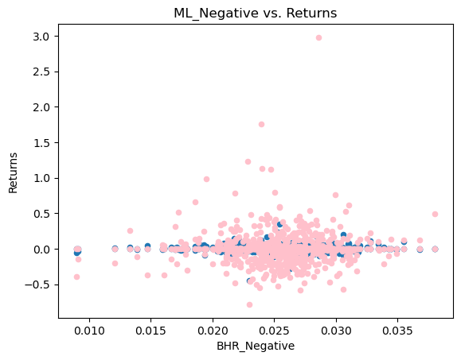

## About Me

I am a student at Lehigh University studying Finance and Business Analytics. I am excited to pursue a career in the field of finance. One of my favorite hobbies is playing tennis, I really enjoy the pace of the game and is a great sport to play. I am known for my ability to keep calm during high pressure situations and being a fast learner which has allowed me to achieve my current goals, however I am always looking to work in a team and achieve team goals. 

---

## Portfolio

_**[Natural language processing 10-Ks to identify sentiment](Report/Report.md)**_

The main concept of this assignment is to conduct sentiment analysis across various 10-k reports posted on the SEC EDGAR website. By using a multitude of lists and dictionaries. The main concept is to determine whether some words are able to predict or tell us more about the stock's returns two to ten days after the filing has been posted publicly. In addition, calculating the returns for both time frames and merging it with the sentiment analysis that was conducted across firms included in the S&P500. 

---
_**[Analyzing Stock Returns During the Russo-Ukrainian War](https://russiaukrainewarindustryreturns.streamlit.app/)**_

The main concept of this assignment is to "Determine the extent to which reported key event dates in the Russia-Ukrainian war affected the returns for major firms in the Energy, Food, Transport, Semiconductors, and Metal industries from the start of the conflict until today." By downloading stock prices for the five major industries firms' recorded in Yahoo Finance. Daily, excess, and cumulative stock returns were calculated in order to compare them to the S&P 500 returns for this period and determine significant trends of how recorded key events during the war impacted industries.

---

_**Internship at Golden Investment S.A**_

● Managed a sales alliance with a food distribution company, Rappi, in order to reduce transaction fees for customers by 3%. This strategy resulted in additional sales and increased profitability for Golden Investment S.A and Rappi.

● Analyzed current restaurant sales for Golden Investment S.A which led to an alliance with an international bank, BBVA, resulting in special discounts for the latter’s executive clients.

● Directed a team project that consisted of calculating the new break-even point for the firm, which was then approved and adopted by the board of directors, allowing them to determine new possible investment projects.

---

## Career Objectives

Securing a financal analyst position at a dynamic and fast-paced company, where I am able to leverage my experience in financial analysis, finanical reporting, and improve the operational efficiency of the firm. My abilities in financial modeling and forecasting will allow me to identify specific trends and opportunities of growth of the company.

---

## Hobbies

One of my favorite hobbies is to play tennis, I really enjoy the fast pace of the sport as well as playing with teammates. I beliebe communication is key in this sport and is one of the most competitive, and I am always looking for ways to improve. 

---

Page template forked from <a href="https://github.com/evanca/quick-portfolio">evanca</a>

<!-- Remove above link if you don't want to attibute -->
